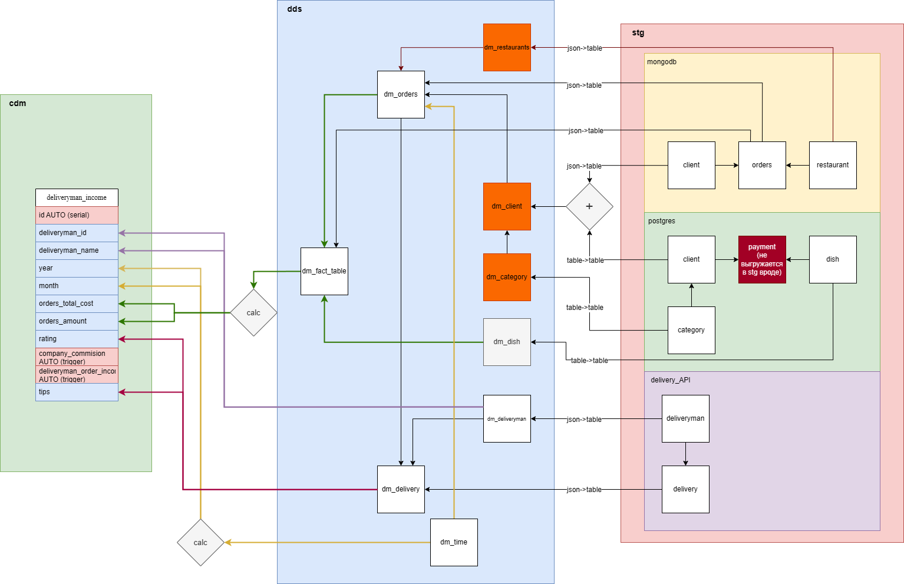

# Хранилища и Базы данных - Лабораторная 1

## Полезные ссылки
[Задание](./docs/Заданька.pdf)

### Как запустить?
1. `cd docker`
2. `docker-compose up`
3. PostgreSQL, MongoDB автоматически запустит скрипты, для заполнения БД.
4. Входим в airflow по адресу `localhost:8080` логин/пароль: `airflow`/`airflow`.
5. Заходим во вкладку DAGs и смотрим как они работают. Фактическни нужно подождать 1 минуту примерно, чтобы все инициализировалось и отработало.

### Данные для подключения
#### PostgreSQL
+ Login: `postgres`
+ Password: `postgres`
+ DataBase: `postgres`
+ Port: `5432`

#### MongoDB
+ Login: `root`
+ Password: `root`
+ DataBase: `mydatabase`
+ Port: `27017`

#### AirFlow
+ Login: `airflow`
+ Password: `airflow`
+ URL: http://localhost:8080

---

# Схема связей между слоями и таблицами

1. Все что было в postgre, mongo и api -- мы передаем на слой `stg` как есть.
2. Затем мы парсим данные из json со слоя `stg` и передаем на слой `dds` и раскладываем по таблицам.
3. После того как передали все данные, заполняем таблицу фактом `dds.dm_fact_table`.
4. Затем на основе данных из слоя `dds` получаем данные для витрины на слое `cdm`.

Все, что помечено оранжевым, не используется для витрины, но информация нужна для поддержания связей между другими таблицами, т.к. там FK (внешние ключи).